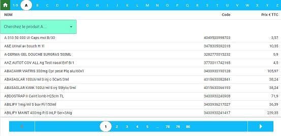

# App Description

Search Product Module for the Pharmacy

# Backend PHP reads a DBB

> > First step: export CSV file
> > Second step: CSV pass to SQL file
> > Load SQL data in config_test.php on the Backend

